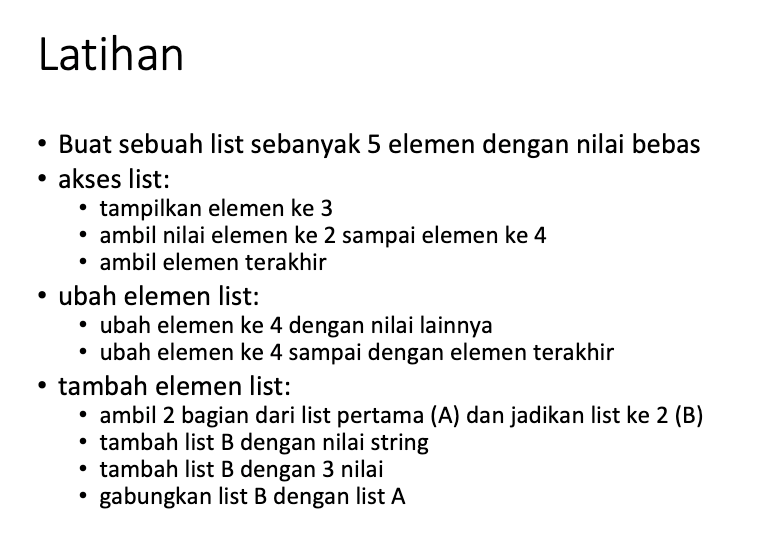
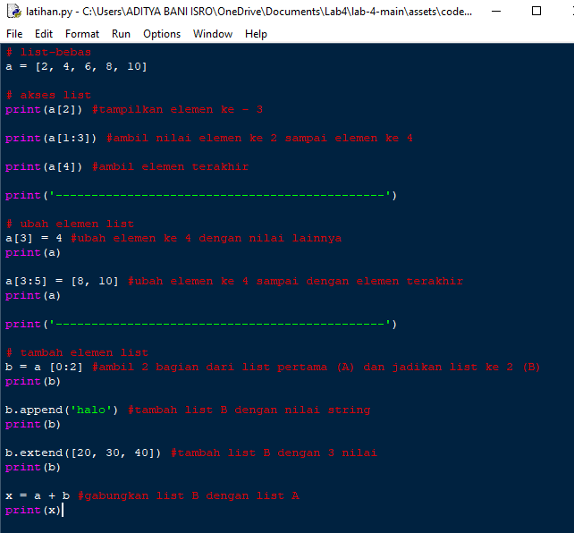
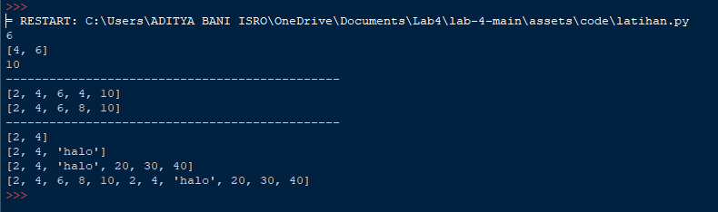
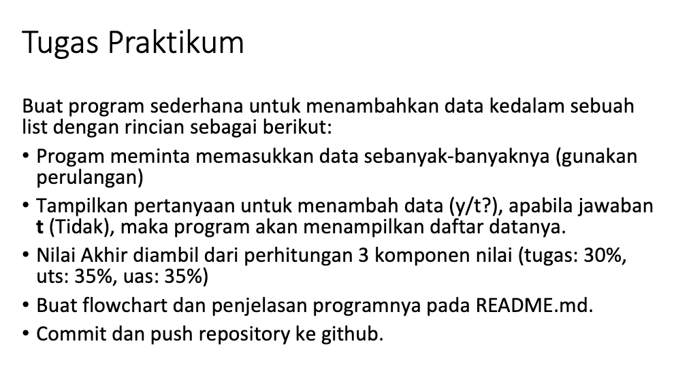
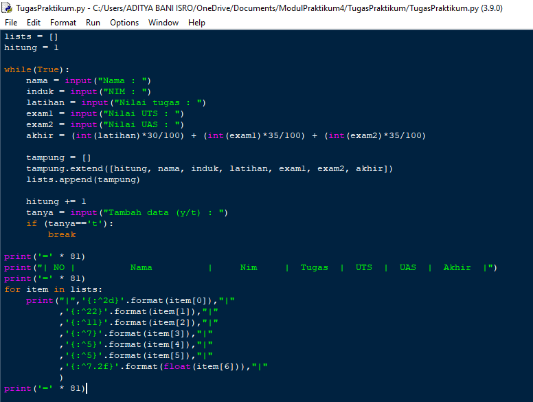
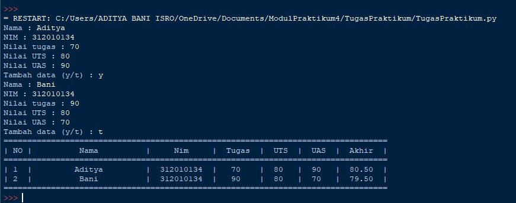
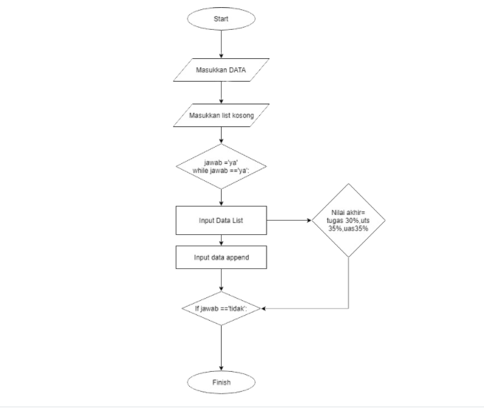

# Lab 4
## Latihan 1

**Code:**

**Penjelasan:**
* ``a = [2, 4, 6, 8, 10] `` list a dengan 5 elemen

Akses list
* ``print(a[2])`` menampilkan elemen ke - 3
* ``print(a[1:3])`` mengambil nilai elemen ke 2 sampai elemen ke 4
* ``print(a[4])`` mengambil elemen terakhir

ubah elemen list
* ``a[3] = 4`` mengubah elemen ke 4 dengan nilai lainnya
* ``a[3:5] = [8, 10]`` mengubah elemen ke 4 sampai dengan elemen terakhir

tambah elemen list
* ``b = a [0:2]`` mengambil 2 bagian dari list pertama (A) dan jadikan list ke 2 (B)
* ``b.append('halo')`` menambah list B dengan nilai string
* ``b.extend([20, 30, ])`` menambah list B dengan 3 nilai
* ``x = a + b`` menggabungkan list B dengan list A

**Output:**

## Tugas Praktikum 4

**Code:**

### Jawab
  - Salin kode berikut ke pythonshell.

        1   lists = []
        2   hitung = 1
        3
        4   while(True):
        5       nama = input("Nama : ")
        6       induk = input("NIM : ")
        7       latihan = input("Nilai tugas : ")
        8       exam1 = input("Nilai UTS : ")
        9       exam2 = input("Nilai UAS : ")
        10      akhir = (int(latihan)*30/100) + (int(exam1)*35/100) + (int(exam2)*35/100)
        11
        12      tampung = []
        13      tampung.extend([hitung, nama, induk, latihan, exam1, exam2, akhir])
        14      lists.append(tampung)
        15
        16      hitung += 1
        17      tanya = input("Tambah data (y/t) : ")
        18      if (tanya=='t'):
        19          break
        20
        21      print('=' * 81)
        22      print("| NO |          Nama          |     Nim     |  Tugas  |  UTS  |  UAS  |  Akhir  |")
        23      print('=' * 81)
        24      for item in lists:
        25          print("|",'{:^2d}'.format(item[0]),"|"
        26                ,'{:^22}'.format(item[1]),"|"
        27                ,'{:^11}'.format(item[2]),"|"
        28                ,'{:^7}'.format(item[3]),"|"
        29                ,'{:^5}'.format(item[4]),"|"
        30                ,'{:^5}'.format(item[5]),"|"
        31                ,'{:^7.2f}'.format(float(item[6])),"|"
        32               )
        33      print('=' * 81)

  - Simpan dengan nama `TugasPraktikum` kemudian jalankan program. Maka akan menampilkan output sebagai berikut :
  

### Penjelasan
  - Di baris **ke-1** dan **2** mendeklarasikan variabel ``lists`` yang akan menyimpan list nantinya. `hitung = 1`menyimpan variabel hitung yang bernilai 1.

  - Baris **ke-4** `While(True)`sebagai perulangan, kode/ baris program yang dibawahnya akan terus berulang sampai program diberhentikan.

  - Baris **ke-5** sampai **9** terdapat `input`, agar user dapat memasukan _`Nama, NIM, Nilai Tugas, UTS, dan UAS`_. Kemudian di baris **10**, variabel `akhir` akan menjumlahkan `nilai tugas, uts, dan uas` yang user masukkan lalu dibagi tiga(3).

  - Baris **12** membuat list baru, variabel `tampung`.

  - Baris **13** akan menambahkan _`Nama, NIM, Nilai Tugas, UTS, dan UAS`_ yang telah user masukkan tadi, ke variabel `tampung`.

  - Di baris **14**, variabel `tampung` tadi, akan di-oper/ di pindahkan ke variabel `lists` yang ada di baris **1**. Nilai hitung akan bertambah 1. (baris **16**)

  - Membuat variabel `tanya` (baris **17**), jika user memasukkan huruf `t`. Maka program akan berhenti / _break_ dan program akan berlanjut ke baris **Selanjutnya**. Tapi jika user memasukkan huruf `y` atau huruf selain `t`, maka program akan terus berulang dari baris **ke-5** sampai **16**.

  - Tanda sama dengan yang berjumlah 81 akan di tampilkan di layar (Baris **ke-21, 23** dan **33**)

  - Menampilkan ke layar `No | Nama | ...` dan seterusnya.(Baris ke**22**)

  - Baris **24**, `for` akan melakukan perulangan pada variabel `lists`

  - Baris **25** sampai **32** akan mencetak kelayar sesuai jumlah list yang dimasukkan pada variabel `lists` dan sesuai format yang telah ditulis. Kode `'{:^22}'` akan membuat nilai pada `format(item[1])` ruas kanan dan kiri menjadi 22 karakter. Sedangkan `2.f` akan memotong nilai `float` yang mempunyai banyak koma dibelakangnya, menjadi **2** angka di belakang koma.

**Output:**

**Flowchart:**

